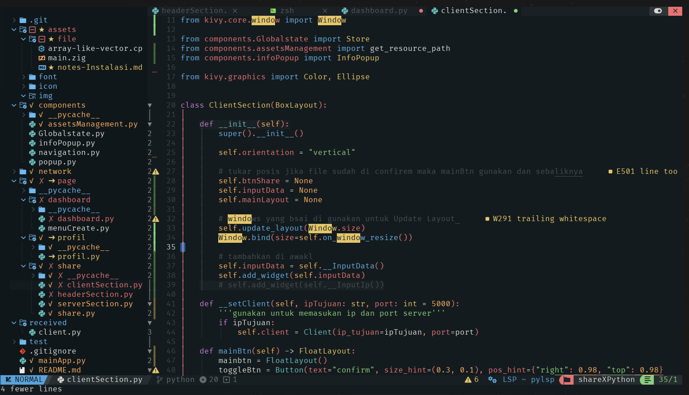

# shareXPython

Apliaksi bekerja dengan coneksi TCP saat client membuka App maka akan menyimpan ip saat ini dari client
untuk terhubung maka client perlu menambah ip server maka file tarsfer bisa di lakukan


## 🔧 Tech Stack

[](https://skillicons.dev)


### **daftar page,fitur  untuk aplikasi *Berbagi File Lokal* | Python + kivy (tanpa internet, via  socket TCP):

```
┌─────────────┐         WiFi LAN         ┌──────────────┐
│   Client    │  ─────────────────────▶  │    Server    │
│ (Pengirim)  │                          │  (Penerima)  │
└─────────────┘                          └──────────────┘
```

- server menunggu file masuk dan client akan mengirimkan file
-  salah satu aplikasi harus berperan sebagai server, dan yang lain sebagai client.

 1. **Halaman Utama (Dashboard)**
* management file 
* Status koneksi: “Tersambung ke jaringan lokal” / “Tidak tersambung”

 2. **Share (Sender | Receiver)**
__Serder__ atau Client
* Tombol **Pilih File / Folder**
* Daftar file yang akan dikirim
* Input alamat IP perangkat penerima
* Tombol **Kirim**
* Progress bar pengiriman
* Notifikasi sukses/gagal
__Receiver__ atau Server
* Tombol **Mulai Menerima**
* Menampilkan alamat IP lokal (untuk diketik oleh pengirim)
* Daftar file yang diterima
* Opsi folder tujuan penyimpanan
* Progress bar penerimaan

3. Profil 
* Ganti port komunikasi (default: 9090)
* Folder default penyimpanan

### project screenshot



### konfigurasi 

Aktifkan virtual env di linux
```bash
source shareXPython/bin/activate
``` 

### package
1. kivy = package utama untuk membagun programnya
2. plyer = untuk menangani file upload di __android dan ios__
    konfigurasi player
    Jika kamu akan build ke Android, pastikan tambahkan plyer ke buildozer.spec:

    - buildozer.spec
    ```bash
    requirements = python3,kivy,plyer
    Dan jika kamu pakai fitur seperti filechooser dari plyer, tambahkan juga android.permissions:
    ```
    ```bash
    android.permissions = READ_EXTERNAL_STORAGE,WRITE_EXTERNAL_STORAGE
    ```

### folder
- `assets\file` : folder dari hasil file yg di upload user ( nantik gunakan di profile dan yg akan di kirim oleh **client**) 

- `tets` : uji coba 

- `Network` : folder konfigurasi backend untuk sinyal proses pengiriman file 
    1. client.py = adalah tiap tiap client yang terhubung 

- `receiver` = folder akan berisi file yang akan di terima dari client 
    untuk sekarang hanya bisa menerima file 2 enter aja
